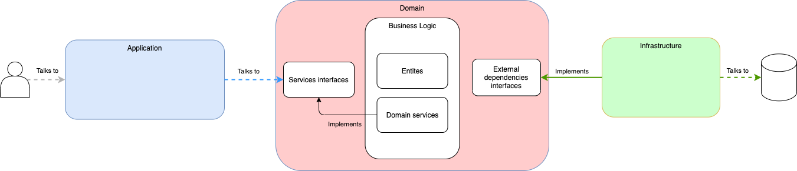

# IKEA WAREHOUSE

Data model considerations
---
The API is designed according to the files provided (inventory.json and products.json).

In my opinion, doing little changes to the inputs, the API can be redesigned to simplify the code and improve maintainability.

Also, I would not recommend using numbers as identifiers since this can be a problem when merging databases from different environments because of collisions between these IDs.
Changing these IDs to UUIDs, which its probability of collision is practically non-existent, would be an optimum choice.

Tech stack
---
The project used the followig technologies:
- Java 11
- Spring Boot 2.4.2
- MongoDB 4.4
- Github Actions
- Github Packages

Continuous integration and continuous deployment (CI/CD)
---
The steps defined in CI workflow are the following:
- Build: This step compiles the code. This step runs on every pipeline
- Test: The mission of this step is to run all tests in the project
    - CI on every push: This pipeline only runs unit tests on this step.
    - CI on PRs and main branch: It runs unit and integration tests.
- Publish artifacts: This step publishes the artifacts on github packages
- Publish docker: This step builds the docker images and publishes them to dockerhub repositories
- Publish chart: This step builds a helm chart and publishes it into gh-pages

Also it is integrated on github as required to pass the Build and Test checks on every pull request

Security
---
Because of the lack of time, these coding test have not any security implemented, in a production environment these APIs should have a security layer using JWT tokens or the OAuth2 standard.
Also, I would suggest having a gateway on top of these this service, so you only expose these APIs through it.

API documentation
---
The API is documented with Swagger following the OpenAPI 3 Specification.

- Swagger: <ur>http://localhost:8080/swagger</url>

Heathcheck
---
The API have the basic actuator endpoints to check if the service is running.

- Health endpoint: <ur>http://localhost:8080/actuator/health</url>

Software architecture
---

The code is structured in three layers so we can have a codebase more scalable, maintainable and testable.

The application layer is the only one that interacts with the user or any third party wanting to interact with our application. It is the **entrypoint**. Here we have all the REST controllers and we do all the transformations to adapt the user inputs to our domain.

In the domain layer, we define our domain and we work with our entities to perform some business logic, i.e. Reducing the stock of some articles if we sell a product.
Also, we define the interfaces for the repositories or any other external API.

The infrastructure layer contains all the implementations for the APIs or repositories defined on the domain layer and, if applies, any configuration parameters for our application. So, here we have all the infrastructure implementations that our application needs to work.

Build
---
In order to build all components, from root folder you have to do one of the following steps:

- Build helm chart locally:  
  **Note: You need to have installed kompose and helm CLI**  
  Run the script `build-all.sh` on the root folder with the following command  
  <code>PACKAGE=true BUILD_IMAGES=true ./build-all.sh</code>

- Compile and build docker image:  
  From the root folder, run the following command on both:  <code>./gradlew build && cd docker && ./build-image.sh</code>

- Compile:  
  From the root folder, run the following command on both:   <code>./gradlew build</code>

- Compile skipping tests:  
  From the root folder, run the following command on both:   <code>./gradlew build -PskipTests</code>

Run in docker
---

From root folder you have to run the following command to start docker containers with the docker hub images:
- <code>REGISTRY=rogomdi/ docker-compose up -d</code>

Or if you have built them on your computer:
- <code>docker-compose up -d</code>

When you run docker compose, these are the ports exposed to your computer:
- 2717 for MongoDB
- 8080 for Warehouse

Run in kubernetes
---
**Note: You need to have installed kompose and helm CLI**  

From root folder you have to run the following command to run it building the images:
- <code>PACKAGE=true BUILD_IMAGES=true ./build-all.sh</code>

Or you can run it with the images uploaded to dockerhub by the CD:
- <code>REGISTRY=rogomdi/ ./build-all.sh</code>

Install the chart by running: `helm install ikea-coding-challenge app-1.0.0-local.tgz`

Since we have not configured any Ingress controller, to access the API you will need to expose the ports.
To do that we will need to run the following commands:
 
1. Exposing warehouse:
    - <code>POD_NAME=$(kubectl get pods | grep warehouse | awk '{print $1}')</code>
    - <code>kubectl port-forward $POD_NAME 8080:8080</code>

FAQ
---
1. Why use a NoSQL database such as MongoDB?
     Since it is a warehouse software, the most probably is that we need to run some data analytics over the products. 
   I.e. How many products are sold last month in order to check the trends and provide with more stock the warehouse.
   Also, a NoSQL database scales horizontally while a SQL database scales vertically, so it is easier and cheaper scale a NoSQL database.

2. Why use Github Actions?
     I have selected it because it is easy to configure and it is fully integrated with Github
   